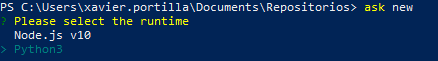
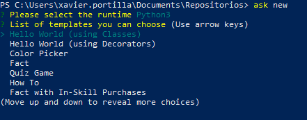
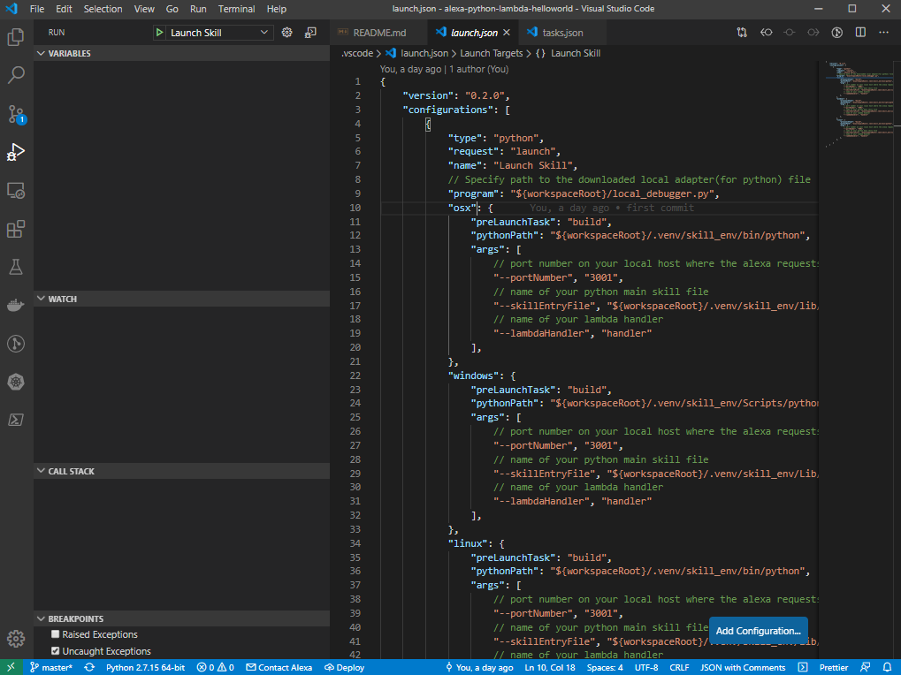
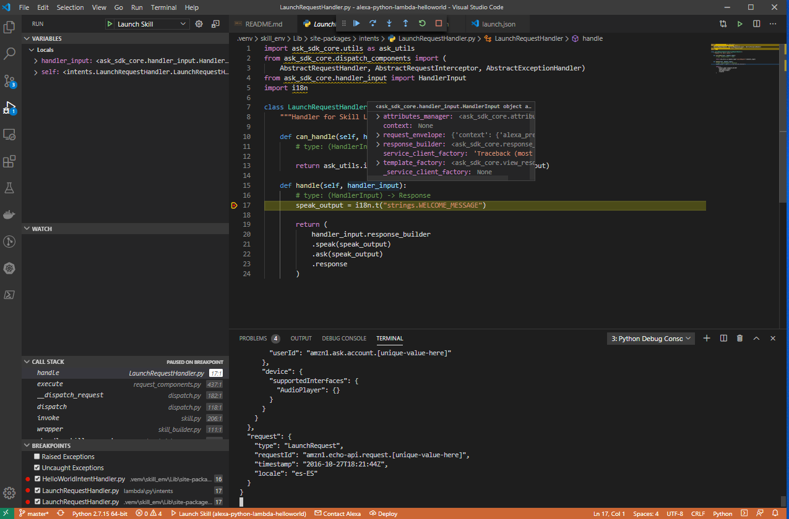
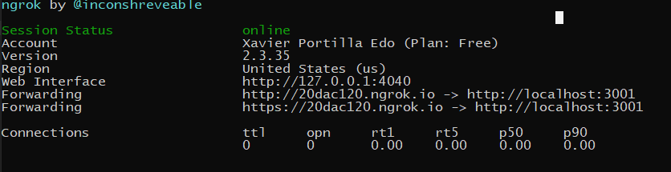

# Alexa Skill with Python

Alexa skills can be developed using Alexa Lambda functions or a REST API endpoint. 
Lambda function is Amazon's implementation of serverless functions available in AWS. 
Amazon recommends using Lambda functions despite they are not easy to debug. 
While you can log to a CloudWatch log, you can't hit a breakpoint and step into the code. 
 
This makes live debugging of Alexa requests a very hard task.
In this post, we will implement a custom skill for Amazon Alexa by using Python, npm and AWS Lambda Functions. This skill is basically a Hello World example. 
With this post you will be able to create a custom skill for Amazon Alexa, implement functionality by using Python and start your custom skill both from your local computer and from AWS.
This post contains materials from different resources that can be seen on Resources section.

## Prerequisites

Here you have the technologies used in this project
1. Amazon Developer Account - [How to get it](http://developer.amazon.com/)
2. AWS Account - [Sign up here for free](https://aws.amazon.com/)
3. ASK CLI - [Install and configure ASK CLI](https://developer.amazon.com/es-ES/docs/alexa/smapi/quick-start-alexa-skills-kit-command-line-interface.html)
4. Python 3.x
5. Visual Studio Code
6. pip Package Manager
7. Alexa ASK for Python (Version >1.10.2)
8. ngrok

The Alexa Skills Kit Command Line Interface (ASK CLI) is a tool for you to manage your Alexa skills and related resources, such as AWS Lambda functions.
With ASK CLI, you have access to the Skill Management API, which allows you to manage Alexa skills programmatically from the command line.
We will use this powerful tool to create, build, deploy and manage our Hello World Skill. Let's start!

## Creating the Skill with ASK CLI

For creating the Alexa Skill, we will use de ASK CLI previously configured. First of all, we have to execute this command:

```bash

    ask new

```
This command will run and interactive step-by-step creation process:

1. The first thing the ASK CLI is going to ask us is the runtime of our Skill. In our case, `Python3`:



2. The second step is the template of the Skill that our Skill is going to base on. In our case, we will select `Hello World (Using Classes)` template:



3. Finally, the ASK CLI is going to ask about the name of the Skill. We will setup the name `alexa-python-lambda-helloworld`


## Project Files 

These are the main files of the project:

```bash

    ├───.ask
    │       config
    │
    ├───.vscode
    │       launch.json
    │       tasks.json
    ├───hooks
    ├───lambda
    │   └───py
    │         ├───errors
    │         ├───intents
    │         ├───interceptors
    │         ├───locales
    │         ├─── hello_world.py
    │         └─── requirements.txt
    ├───models
    │       es-ES.json
    ├───skill.json
    └───local_debugger.py


```

* .ask: folder which contains the ASK CLI's config file. This config files will remain empty until we execute the command `ask deploy`
* `.vscode/launch.json`: Launch preferences to run locally your Skill for local testing and executes all the tasks in `.vscode/tasks.json`. This setting launch `local_debugger.py`. This script runs a server on http://localhost:3001 for debug the Skill.
* hooks: A folder that contains the hook scripts. Amazon provides two hooks, post_new_hook and pre_deploy_hook.
  * `post_new_hook`: executed after the Skill creation. In Python creates a Virtual Environment located at `.venv/skill_env`.
  * `pre_deploy_hook`: executed before the Skill deployment. In python creates the folder `lambda/py/lambda_upload` where will be stored all the necessary to upload the lambda to AWS..
* lambda/py: A folder that contains the source code for the skill's AWS Lambda function:
  * `hello_world.py`: the lambda main entry point.
  * `locales`: i18n dictionaries used by the library `python-i18n` which allow us to run same in Skill in different configuration languages.
  * `requirementes.txt`: this file stores the Python dependencies of our project and is a basic part of understanding and working with Python and pip.
  * `errors`: folder that contains all Error handlers.
  * `intents`: folder that contains all Intent handlers.
  * `interceptors`: here you can find all interceptors.
* models – A folder that contains interaction models for the skill. Each interaction model is defined in a JSON file named according to the locale. For example, es-ES.json.
* `skill.json` – The skill manifest. One of the most important files in our project.
* `local_debugger.py`: used for debug our skill locally.


## Lambda function in Python

The ASK SDK for Python makes it easier for you to build highly engaging skills by allowing you to spend more time implementing features and less time writing boilerplate code.

You can find documentation, samples and helpful links in their official [GitHub repository](https://github.com/alexa/alexa-skills-kit-sdk-for-python)

The main Python file in our lambda project is `hello_world.py` located in `lambda/py` folder. This file contains all handlers, interceptors and exports the Skill handler in `handler` object.

The `handler` object is executed every time AWS Lambda is initiated for this particular function. 
In theory, an AWS Lambda function is just a single function. This means that we need to define dispatching logic so a single function request can route to appropriate code, hence the handlers.

```python

  from ask_sdk_core.skill_builder import SkillBuilder
  from ask_sdk_model import Response
  from intents import LaunchRequestHandler as launch
  from intents import HelloWorldIntentHandler as hello
  from intents import HelpIntentHandler as help
  from intents import CancelOrStopIntentHandler as cancel
  from intents import SessionEndedRequestHandler as session
  from intents import IntentReflectorHandler as reflector
  from errors import CatchAllExceptionHandler as errors
  from interceptors import LocalizationInterceptor as locale

  # The SkillBuilder object acts as the entry point for your skill, routing all request and response
  # payloads to the handlers above. Make sure any new handlers or interceptors you've
  # defined are included below. The order matters - they're processed top to bottom.
  sb = SkillBuilder()

  sb.add_request_handler(launch.LaunchRequestHandler())
  sb.add_request_handler(hello.HelloWorldIntentHandler())
  sb.add_request_handler(help.HelpIntentHandler())
  sb.add_request_handler(cancel.CancelOrStopIntentHandler())
  sb.add_request_handler(session.SessionEndedRequestHandler())
  # make sure IntentReflectorHandler is last so it doesn't override your custom intent handlers
  sb.add_request_handler(reflector.IntentReflectorHandler())

  sb.add_global_request_interceptor(locale.LocalizationInterceptor())

  sb.add_exception_handler(errors.CatchAllExceptionHandler())

  handler = sb.lambda_handler()

```
It is important to take a look into the `LaunchRequestHandler` as an example of Alexa Skill handler written in Python:

```python

  class LaunchRequestHandler(AbstractRequestHandler):
      """Handler for Skill Launch."""

      def can_handle(self, handler_input):
          # type: (HandlerInput) -> bool

          return ask_utils.is_request_type("LaunchRequest")(handler_input)

      def handle(self, handler_input):
          # type: (HandlerInput) -> Response
          speak_output = i18n.t("strings.WELCOME_MESSAGE")

          return (
              handler_input.response_builder
              .speak(speak_output)
              .ask(speak_output)
              .response
          )

```

## Building the Skill with Visual Studio Code

The build of the skill is fully automated with the `launch.json` and `tasks.json` in `.vscode` folder . 
The first file is used for running the skill locally but before that moment we will execute some tasks defined in the second file which are:

1. `create_env`: this task will execute the `hooks\post_new_hook`. This scprit will do these tasks:
   * Will install if it is not installed the `virtualenv` library using `pip`.
   * After install it, it will create a new Python Virtual Environment if it is not created at `.venv/skill_env`
2. `install_dependencies`: This task will install all dependencies located in `lambda/py/requirements.txt` using the Python Virtual Environment created above.
3. `build`: Finally, it will copy all the source code from `lambda\py` to the Python Virtual environment `site-packages` folder.   

Here you have the `tasks.json` where you can find the tasks explained above and the commands separated per operative system:
```json
  {
      // See https://go.microsoft.com/fwlink/?LinkId=733558
      // for the documentation about the tasks.json format
      "version": "2.0.0",
      "tasks": [
          {
              "label": "create_env",
              "type": "shell",
              "osx": {
                  "command": "${workspaceRoot}/hooks/post_new_hook.sh ."
              },
              "windows": {
                  "command": "${workspaceRoot}/hooks/post_new_hook.ps1 ."
              },
              "linux": {
                  "command": "${workspaceRoot}/hooks/post_new_hook.sh ."
              }
          },{
              "label": "install_dependencies",
              "type": "shell",
              "osx": {
                  "command": ".venv/skill_env/bin/pip -q install -r ${workspaceRoot}/lambda/py/requirements.txt",
              },
              "windows": {
                  "command": ".venv/skill_env/Scripts/pip -q install -r ${workspaceRoot}/lambda/py/requirements.txt",
              },
              "linux": {
                  "command": ".venv/skill_env/bin/pip -q install -r ${workspaceRoot}/lambda/py/requirements.txt",
              },
              "dependsOn": [
                  "create_env"
              ]
          },{
              "label": "build",
              "type": "shell",
              "osx": {
                  "command": "cp -r ${workspaceRoot}/lambda/py/ ${workspaceRoot}/.venv/skill_env/lib/python3.8/site-packages/",
              },
              "windows": {
                  "command": "xcopy \"${workspaceRoot}\\lambda\\py\" \"${workspaceRoot}\\.venv\\skill_env\\Lib\\site-packages\" /s /e /h /y",
              },
              "linux": {
                  "command": "cp -r ${workspaceRoot}/lambda/py/ ${workspaceRoot}/.venv/skill_env/lib/python3.8/site-packages/",
              },            
              "dependsOn": [
                  "install_dependencies"
              ]
          }
      ]
  }

```

After that, the skill is ready to be launched locally!

So for build your skill the only thing you have to do is run it locally in Visual Studio Code:




**NOTE:** pay attention with folder `${workspaceRoot}/.venv/skill_env/lib/python3.8/site-packages/` in Linux and OSX in the task `build`. You have to replace `python3.8` if you are using another version of Python.

## Running the Skill with Visual Studio Code

The `launch.json` file in `.vscode` folder has the configuration for Visual Studio Code which allow us to run our lambda locally:

```json

  {
      "version": "0.2.0",
      "configurations": [
          {
              "type": "python",
              "request": "launch",
              "name": "Launch Skill",
              "justMyCode": false,
              // Specify path to the downloaded local adapter(for python) file
              "program": "${workspaceRoot}/local_debugger.py",
              "osx": {
                  "preLaunchTask": "build",
                  "pythonPath": "${workspaceRoot}/.venv/skill_env/bin/python",
                  "args": [
                      // port number on your local host where the alexa requests will be routed to
                      "--portNumber", "3001",
                      // name of your python main skill file
                      "--skillEntryFile", "${workspaceRoot}/.venv/skill_env/lib/python3.8/site-packages/hello_world.py",
                      // name of your lambda handler
                      "--lambdaHandler", "handler"
                  ],
              },
              "windows": {
                  "preLaunchTask": "build",
                  "pythonPath": "${workspaceRoot}/.venv/skill_env/Scripts/python.exe",
                  "args": [
                      // port number on your local host where the alexa requests will be routed to
                      "--portNumber", "3001",
                      // name of your python main skill file
                      "--skillEntryFile", "${workspaceRoot}/.venv/skill_env/Lib/site-packages/hello_world.py",
                      // name of your lambda handler
                      "--lambdaHandler", "handler"
                  ],
              },
              "linux": {
                  "preLaunchTask": "build",
                  "pythonPath": "${workspaceRoot}/.venv/skill_env/bin/python",
                  "args": [
                      // port number on your local host where the alexa requests will be routed to
                      "--portNumber", "3001",
                      // name of your python main skill file
                      "--skillEntryFile", "${workspaceRoot}/.venv/skill_env/lib/python3.8/site-packages/hello_world.py",
                      // name of your lambda handler
                      "--lambdaHandler", "handler"
                  ],
              },
              
          }
      ]
  }

```
This configuration file will execute the steps explained in the previous section and the will run the following command:

```bash

  .venv/skill_env/scripts/python local_debugger.py --portNumber 3001 --skillEntryFile .venv/skill_env/Lib/site-packages/hello_world.py --lambdaHandler handler

```

This configuration uses the `local_debugger.py` file which runs a [TCP server](https://docs.python.org/3/library/socket.html) listening on http://localhost:3001

For a new incoming skill request a new socket connection is established.
From the data received on the socket the request body is extracted, parsed into JSON and passed to the skill invoker's lambda handler.
The response from the lambda handler is parsed as a HTTP 200 message format as specified [here](https://developer.amazon.com/docs/custom-skills/request-and-response-json-reference.html#http-header-1)
The response is written onto the socket connection and returned.

After configuring our launch.json file and understanding how the local debugger works, it is time to click on the play button:


After executing it, you can send Alexa POST requests to http://localhost:3001.

**NOTE:** pay attention with folder `${workspaceRoot}/.venv/skill_env/lib/python3.8/site-packages/hello_world.py` in Linux and OSX in the task `build`. You have to replace `python3.8` if you are using another version of Python.

## Debugging the Skill with Visual Studio Code

Following the steps before, now you can set up breakpoints wherever you want inside all Python files in the `site-package` folder of the Python Virtual Environment in order to debug your skill:



## Testing requests locally

I'm sure you already know the famous tool call [Postman](https://www.postman.com/). REST APIs have become the new standard in providing a public and secure interface for your service. Though REST has become ubiquitous, it's not always easy to test. Postman, makes it easier to test and manage HTTP REST APIs. Postman gives us multiple features to import, test and share APIs, which will help you and your team be more productive in the long run.

After run your application you will have an endpoint available at http://localhost:3001. With Postman you can emulate any Alexa Request. 

For example, you can test a `LaunchRequest`:

```json

  {
    "version": "1.0",
    "session": {
      "new": true,
      "sessionId": "amzn1.echo-api.session.[unique-value-here]",
      "application": {
        "applicationId": "amzn1.ask.skill.[unique-value-here]"
      },
      "user": {
        "userId": "amzn1.ask.account.[unique-value-here]"
      },
      "attributes": {}
    },
    "context": {
      "AudioPlayer": {
        "playerActivity": "IDLE"
      },
      "System": {
        "application": {
          "applicationId": "amzn1.ask.skill.[unique-value-here]"
        },
        "user": {
          "userId": "amzn1.ask.account.[unique-value-here]"
        },
        "device": {
          "supportedInterfaces": {
            "AudioPlayer": {}
          }
        }
      }
    },
    "request": {
      "type": "LaunchRequest",
      "requestId": "amzn1.echo-api.request.[unique-value-here]",
      "timestamp": "2020-03-22T17:24:44Z",
      "locale": "en-US"
    }
  }

```

## Deploying your Alexa Skill

With the code ready to go, we need to deploy it on AWS Lambda so it can be connected to Alexa.

Before deploy the Alexa Skill, we can show the `config` file in `.ask` folder it is empty:

```json
    {
      "deploy_settings": {
        "default": {
          "skill_id": "",
          "was_cloned": false,
          "merge": {}
        }
      }
    }

```

Deploy Alexa Skill with ASK CLI:

```bash
    ask deploy
```

As the official documentation says:

When the local skill project has never been deployed, ASK CLI creates a new skill in the development stage for your account, then deploys the skill project. If applicable, ASK CLI creates one or more new AWS Lambda functions in your AWS account and uploads the Lambda function code. Specifically, ASK CLI does the following:

1. Looks in your skill project's config file (in the .ask folder, which is in the skill project folder) for an existing skill ID. If the config file does not contain a skill ID, ASK CLI creates a new skill using the skill manifest in the skill project's skill.json file, then adds the skill ID to the skill project's config file.
2. Looks in your skill project's manifest (skill.json file) for the skill's published locales. These are listed in the manifest.publishingInformation.locales object. For each locale, ASK CLI looks in the skill project's models folder for a corresponding model file (for example, es-ES.json), then uploads the model to your skill. ASK CLI waits for the uploaded models to build, then adds each model's eTag to the skill project's config file.
3. Looks in your skill project's manifest (skill.json file) for AWS Lambda endpoints. These are listed in the manifest.apis.<skill type>.endpoint or manifest.apis.<skill type>.regions.<region code>.endpoint objects (for example, manifest.apis.custom.endpoint or manifest.apis.smartHome.regions.NA.endpoint). Each endpoint object contains a sourceDir value, and optionally a uri value. ASK CLI upload the contents of the sourceDir folder to the corresponding AWS Lambda function and names the Lambda function the same as the uri value. For more details about how ASK CLI performs uploads to Lambda, see AWS Lambda deployment details.
4. Looks in your skill project folder for in-skill products, and if it finds any, uploads them to your skill. For more information about in-skill products, see the In-Skill Purchasing Overview.

In Python there are some more steps. Before deploy your Alexa Skill, the script `pre_deploy_hook` in `hooks` folder will be executed. This script will be run the following tasks:
1. It will copy all the files of your `site-packages` of your Python Virtual Environment in a new folder called `lambda_upload` located in `lambda/py` folder.
2. Then will copy the source code of your skill written in Python located in `lambda/py` in `lambda/py/lambda_puload`.
3. Finally, this new folder as a `.zip` will be deployed to AWS.

After the execution of the above command, we will have the `config` file properly filled:

```json

  {
    "deploy_settings": {
      "default": {
        "skill_id": "amzn1.ask.skill.53ad2510-5758-48db-9c43-e4263a2055db",
        "resources": {
          "lambda": [
            {
              "alexaUsage": [
                "custom/default"
              ],
              "arn": "arn:aws:lambda:us-east-1:141568529918:function:ask-custom-alexa-python-lambda-helloworld-default",
              "awsRegion": "us-east-1",
              "codeUri": "lambda/py/lambda_upload",
              "functionName": "ask-custom-alexa-python-lambda-helloworld-default",
              "handler": "hello_world.handler",
              "revisionId": "b95879d0-d039-4fa2-b7e5-96746f36689f",
              "runtime": "python3.6"
            }
          ],
          "manifest": {
            "eTag": "3809be2d04cfb7f90dd0fa023920e0bd"
          },
          "interactionModel": {
            "es-ES": {
              "eTag": "235f49ae9fa329de1b7e2489ec7e4622"
            }
          }
        },
        "was_cloned": false,
        "merge": {}
      }
    }
  }

```

## Test requests directly from Alexa

ngrok is a very cool, lightweight tool that creates a secure tunnel on your local machine along with a public URL you can use for browsing your local site or APIs.

When ngrok is running, it listens on the same port that you’re local web server is running on and proxies external requests to your local machine

From there, it’s a simple step to get it to listen to your web server. Say you’re running your local web server on port 3001. In terminal, you’d type in: `ngrok http 3001`. This starts ngrok listening on port 3001 and creates the secure tunnel:



So now you have to go to [Alexa Developer console](https://developer.amazon.com/alexa/console/ask), go to your skill > endpoints > https, add the https url generated above . Eg: https://20dac120.ngrok.io.

Select the My development endpoint is a sub-domain.... option from the dropdown and click save endpoint at the top of the page.

Go to Test tab in the Alexa Developer Console and launch your skill.

The Alexa Developer Console will send a HTTPS request to the ngrok endpoint (https://20dac120.ngrok.io) which will route it to your skill running on Web API server at http://localhost:3001.


## Resources
-  [Official Alexa Skills Kit Python SDK](https://pypi.org/project/ask-sdk/)
-  [Official Alexa Skills Kit Python SDK Docs](https://alexa-skills-kit-python-sdk.readthedocs.io/en/latest/)
-  [Official Alexa Skills Kit Docs](https://developer.amazon.com/docs/ask-overviews/build-skills-with-the-alexa-skills-kit.html)


## Conclusion 

This was a basic tutorial to learn Alexa Skills using Python.
As you have seen in this example, the Alexa Skill Kit for Python and the Alexa Tools like ASK CLI can help us a lot and also they give us the possibility to create skills in an easy way. 
I hope this example project is useful to you.

That's all folks!

Happy coding!
